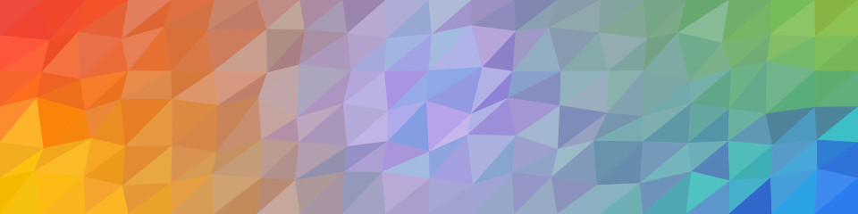

# Triangle mosaic

Generate colorful triangle-based SVG patterns (like this 👇) with ease.



## Demo

You can try Triangle mosaic [on the demo page](http://bence-toth.github.io/triangle-mosaic).


## Installation

To install `triangle-mosaic`, run:

```sh
npm install triangle-mosaic
```


## Quick start

You can import `TriangleMosaic` like this:

```js
import TriangleMosaic from 'triangle-mosaic'
```

`TriangleMosaic` is a class and it can be instantiated like this:

```js
const myMosaic = new TriangleMosaic(options)
```

Then you can call the `render` method which returns the SVG code as a string:

```js
const mySvgCode = myMosaic.render()
```

You can also change the options without losing the random-generated variance by calling the `rehydrate` method with the new options. This will also return the new SVG code as a string:

```js
const myNewSvgCode = myMosaic.rehydrate(newOptions)
```


### Variance

  shapeFuzz: 0.65,
  colorFuzz: {
    hue: 0.1,
    saturation: 0.1,
    lightness: 0.1,
    alpha: 0
  },


### Coloring

Some description.


#### Coloring mode

single, linearGradient, radialGradient, spots


#### Single color

```js
{
  coloring: {
    mode: 'single',
    color: '#ffc107'
  }
}
```


#### Linear gradient

```js
coloring: {
  mode: 'linearGradient',
  start: {
    x: 0,
    y: 0
  },
  end: {
    x: 1280,
    y: 720
  },
  stops: [
    [0, '#9c27b0'],
    [0.25, '#03a9f4'],
    [0.5, '#8bc34a'],
    [0.75, '#ffc107'],
    [1, '#f44336']
  ]
}
```


#### Radial gradient

```js
coloring: {
  mode: 'radialGradient',
  start: {
    x: 480,
    y: 360
  },
  end: {
    x: 0,
    y: 0
  },
  stops: [
    [0, '#9c27b0'],
    [0.25, '#03a9f4'],
    [0.5, '#8bc34a'],
    [0.75, '#ffc107'],
    [1, '#f44336']
  ]
}
```


#### Spots

```js
coloring: {
  mode: 'spots',
  spotIntensity: 0.5,
  spots: [
    {
      x: 0,
      y: 0,
      color: '#ffc107',
      intensity: 0.65
    },
    {
      x: 1280,
      y: 0,
      color: '#f44336'
      // intensity falls back to 0.5
    },
    {
      x: 640,
      y: 720,
      color: '#2196f3',
      intensity: 0.6
    }
  ]
}
```


## License

Triangle Mosaic is [licensed under MIT](./LICENSE).

Whatever you create with the library or web-based tool is yours and you may license it in any way you see fit.
